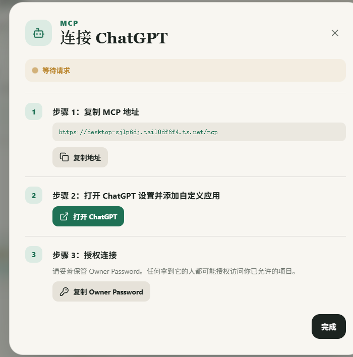

# ChatGPT 连接向导审查

## 审查范围

DevSpace Desktop 的“连接 ChatGPT”弹窗，重点检查用户离开应用、进入 ChatGPT 网页后的操作是否完整可执行。

## 用户目标

不了解 MCP、OAuth 或工作空间权限的用户，也能独立完成 DevSpace 自定义应用的创建、授权和连接验证。

## 步骤 1：原向导

健康度：需要改进。

- 优点：MCP 地址和 Owner Password 都能一键复制，且能打开 ChatGPT。
- 主要风险：“打开 ChatGPT 设置并添加自定义应用”省略了开发者模式入口、创建表单字段、扫描工具、OAuth 授权页面及成功验证，用户离开 DevSpace 后失去引导。
- 状态风险：“完成”按钮在尚未检测到连接时仍可点击，容易形成假完成。
- 权限风险：没有解释套餐、角色或工作空间策略可能导致“创建”和“开发者模式”不可见。
- 可访问性限制：截图可以确认信息层级，但不能证明键盘焦点、屏幕阅读器播报或高倍率缩放表现。

## 已落实的改进

向导扩展为五个连续步骤：自动复制 MCP 地址；打开 ChatGPT 并开启开发者模式；按字段创建 DevSpace 应用并扫描工具；在 Connect DevSpace 页面粘贴 Owner Password 完成 OAuth 授权；新建聊天选择 DevSpace 并发送测试请求。只有 DevSpace 检测到有效 MCP 会话后，“完成”按钮才可用。
