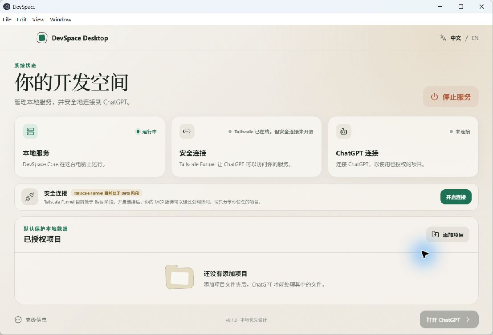

# DevSpace 首用流程：下一步可发现性审查

## 审查范围

Windows 首页在“本地服务运行、Tailscale 在线、安全连接未开启、没有授权项目”时的下一步引导。

## 用户目标

不理解端口、Tunnel 或 MCP 的普通用户，能够按顺序完成：准备环境 → 开启安全连接 → 连接 ChatGPT；连接完成后再按需添加授权项目。

## 步骤 1：环境已准备，但没有明确下一步

健康度：需要改进。

- 优点：本地服务、Tailscale 和 ChatGPT 三项状态都可见；“开启连接”和“添加项目”控件均存在。
- UX 风险：两个可执行操作分散在不同区域，视觉权重接近；页面没有说明推荐顺序，也没有解释安全连接与项目授权是两件独立的事。
- 可访问性风险：状态变化依赖颜色与短文案；流程没有 `aria-current` 或等价语义来告诉辅助技术当前步骤。
- 建议：增加三步首用路径；Tailscale 在线后直接引导“开启安全连接”，然后连接 ChatGPT。项目授权是连接后的独立操作，不属于基础设施设置步骤。

## 证据限制

本次截图与可访问性树覆盖 Windows 桌面首页当前状态。尚未从截图验证键盘焦点顺序、200% 缩放重排及屏幕阅读器实际播报。
